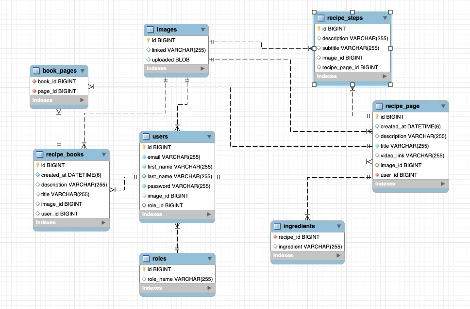

## Cooking_Memories
Cooking Memories is a web application that allows users to save their dearest recipes. 
Inspired by my own desire to have my mother's cooking recipes forever, Cooking Memories
allows you to gather and store precious recipes. You are able to organize your recipes
into books and share with others.

### Technical Perspective
Cooking Memories is a Maven - Spring Boot application. On the backend, MySQL database with 
the object relational mapper Hibernate was used. To test repository queries, J-Unit testing 
was applied. On the frontend, Thymeleaf was used to build dynamic web pages and Spring security 
was utilized to handle authorizations. For styling, Bootstrap and CSS was used in combination.
Furthermore, JavaScript was utilized for image validations, log in validations,
and bootstrap modal implementations. 

## Schema Diagram

### Features for the Future
Theoretically, a user was supposed to be able to share cook books through links.
In the future, I would implement recipe sharing just with a link, like Google Docs.
Recipe steps would also have an image option.
There would also be a spot for Youtube links on recipe pages and the search functionalities would work.